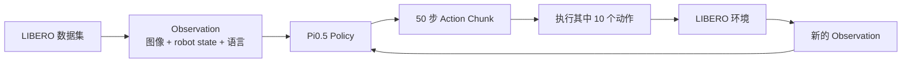
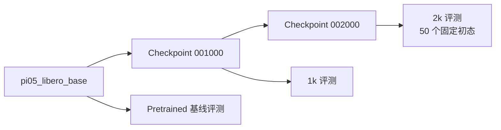
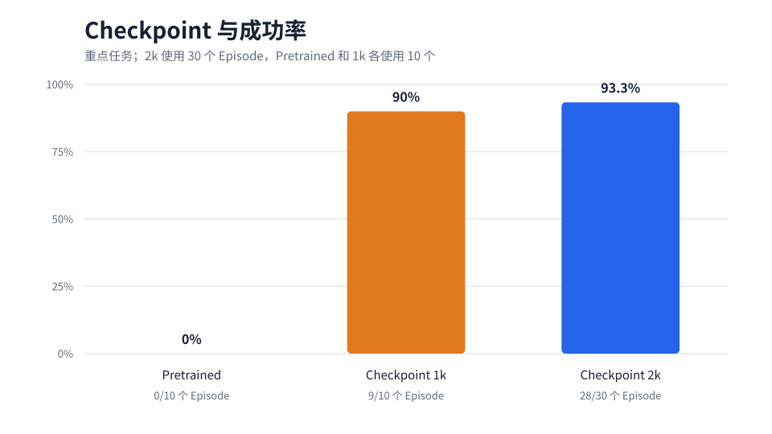
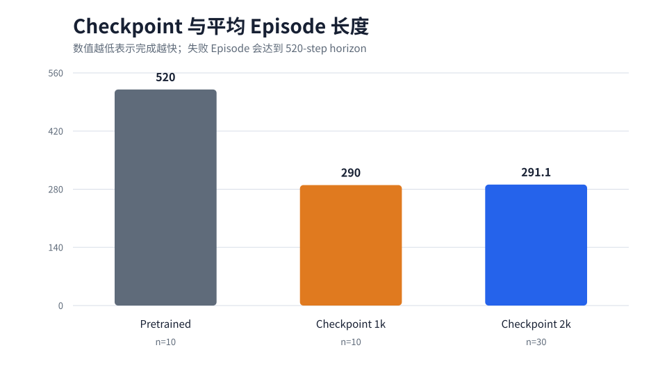
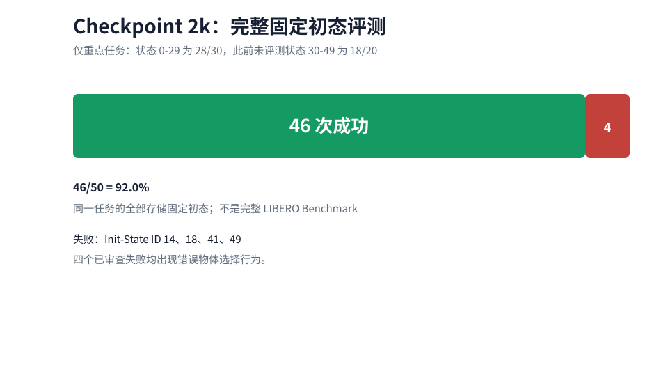
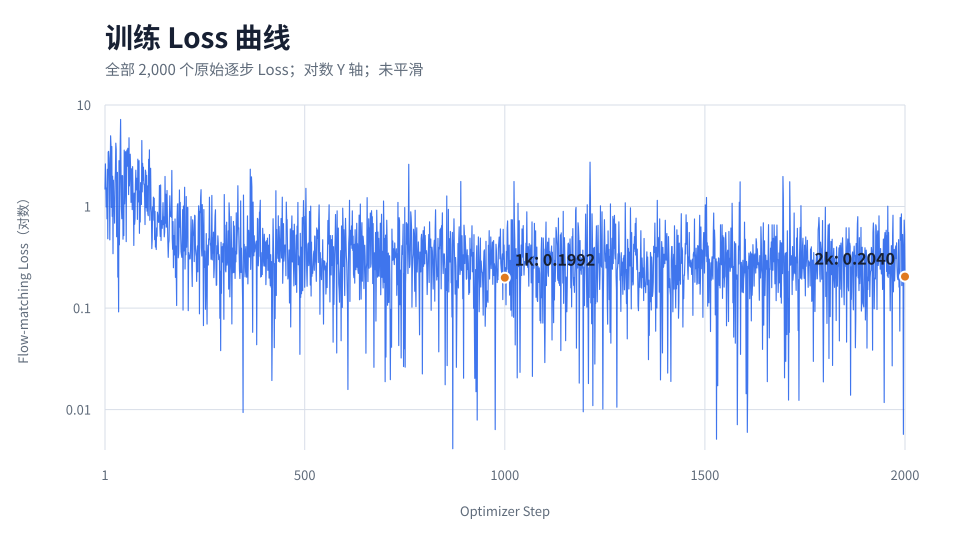
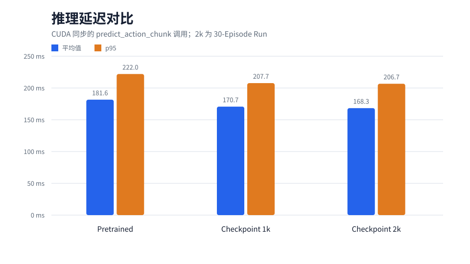

# 在 LIBERO 上进行 π0.5 VLA 持续微调与闭环评测

## 1. 项目概述

本项目在 Linux GPU 服务器上复现 LeRobot 的 Pi0.5 运行环境，并使用固定版本的 40 任务 LIBERO 数据集，对 `lerobot/pi05_libero_base` 继续微调。项目围绕一个重点 LIBERO-10 任务建立闭环 Rollout 协议，对比 pretrained、1k 和 2k checkpoint，测量模型推理延迟，并根据真实 Rollout 视频分析失败案例。

这是一个工程实验与评测项目：LeRobot 提供 policy、数据/训练框架和 LIBERO 集成；本项目负责环境复现、实验控制、性能测量、证据审计和结果整理。

## 2. 系统流程





## 3. 数据集

训练使用完整的 `lerobot/libero` 数据集，revision 固定为 `a1aaacb7f6cd6ee5fb43120f673cebb0cfea7dd4`：

| 属性 | 数值 |
| --- | ---: |
| 任务数 | 40 |
| Episodes | 1,693 |
| Frames | 273,465 |
| Suites | Spatial、Object、Goal、LIBERO-10 |
| Observation | 两路 256×256 RGB 视频 + 8 维状态 |
| Action | 7 维连续控制 |

四个 suite 各含 10 个任务。训练没有使用 task filter，因此这是**多任务持续微调**，不是单任务微调。重点评测指令为 `put both the alphabet soup and the tomato sauce in the basket`，对应 `libero_10` task 0，在训练数据中是 `task_index=5`。

## 4. 训练配置

| 配置项 | 数值 |
| --- | --- |
| 起始 checkpoint | `lerobot/pi05_libero_base` |
| 训练步数 / batch size | 2,000 / 1 |
| 精度 | BF16 policy + BF16 mixed precision |
| 可训练范围 | 仅训练 expert；冻结 vision encoder |
| 显存控制 | 开启 gradient checkpointing |
| GPU | NVIDIA RTX 6000D，PyTorch 报告 83.05 GiB |
| 峰值 allocated / reserved 显存 | 12.848 / 13.004 GiB |
| 平均 / 中位 step 时间 | 0.2237 / 0.2096 秒 |
| Wrapper 总运行时间 | 578.46 秒（9.64 分钟） |
| 结果 | 2,000 步 loss 均为有限值；保存 1k/2k checkpoint；无 OOM |

起始 checkpoint 是 LIBERO 专用的 base checkpoint，而不是通用 `pi05_base`。Pi0.5 由 LeRobot 实现，本项目没有声称发明或重新实现模型架构。

## 5. 评测协议

重点任务是 `libero_10` task 0，episode horizon 为 520 个控制步。每个 episode 使用 hard reset、LIBERO 存储的固定 initial state、两路 360×360 RGB 相机、robot state、相对 7 维动作、BF16 推理、batch size 1 和 `n_action_steps=10`。成功由环境的 `check_success()` 判定。

延迟只测量真实的 `predict_action_chunk` 调用，并在计时前后执行 CUDA synchronization。模型调用之间从 action deque 取出的 9 个缓存动作不计为推理。严格匹配的 checkpoint 对比使用固定状态 0–9；扩展后的 2k 评测覆盖全部 50 个存储状态。

详细协议：[results/evaluation/eval_protocol.md](results/evaluation/eval_protocol.md)。

## 6. 实验结果





| Checkpoint | 评测集合 | 成功数 | 平均 Episode 长度 |
| --- | --- | ---: | ---: |
| Pretrained | 固定状态 0–9 | 0/10 | 520.0 |
| 1k | 固定状态 0–9 | 9/10 | 290.0 |
| 2k | 固定状态 0–29 | 28/30 | 291.13 |

在严格匹配的前十个状态上，2k 为 10/10，平均 episode 长度为 271.9。2k 在全部 50 个固定初态上的结果为 46/50：



状态 30–49 是新增评测、此前未评测的固定初态，不能证明它们在模型训练阶段未出现。





图中展示全部 2,000 个原始 loss，没有人为平滑。1k 到 2k 的 checkpoint 单点 loss 并非单调下降，但匹配 Rollout 成功率有所提高，因此 loss 与闭环成功率必须作为不同指标分别报告。

## 7. 失败分析

2k 在 50 个固定状态中共有 4 次失败：ID 14、18、41 和 49。视频审查发现四次都出现了**错误物体选择（wrong-object-selection）行为**：policy 操作或放置了干扰物，并在 horizon 结束前未能放置两个指定目标物。

- **实际观察：** 选择或放置错误物体；部分 episode 还出现杂物碰撞或恢复不完整。
- **可能解释：** 视觉目标选择、语言条件或 policy 恢复行为可能参与其中。
- **未被证明：** VLM 内部语义或语言理解模块发生故障。

失败证据：[results/evaluation/generalization/failure_analysis.md](results/evaluation/generalization/failure_analysis.md)。

## 8. 项目收获

- 理解图像、语言、robot state 和 action 如何组成 VLA 数据接口；
- 理解 Pi0.5 如何从 Observation 生成 Action Chunk；
- 理解 expert-only、冻结视觉特征、BF16 和 gradient checkpointing 的显存权衡；
- 理解为什么 checkpoint 选择需要闭环评测，不能只看 loss；
- 学会定义可复现的 initial state、horizon、success、latency 和视频协议；
- 理解随机 seed 与 LIBERO 固定 `init_state_id` 并不等价；
- 学会用视频建立行为失败分类，同时避免臆测模型内部原因；
- 理解为什么声称泛化前必须审计训练数据暴露范围。

## 9. 局限性

- 未执行完整的 400-episode、四 suite LIBERO benchmark；
- 未证明 unseen-task transfer 或 open-world generalization；
- 固定状态 30–49 只是此前未被评测，不能证明为 training-held-out states；
- `pi05_libero_base` 本身已经接受过 LIBERO 训练；
- 深度 checkpoint 对比和 50-state 评测主要针对一个 LIBERO-10 任务；
- 未进行 LIBERO-plus 扰动、Isaac Sim、ROS 2 集成或真实机器人部署；
- `46/50` 是同任务固定初态结果，不是“LIBERO 成功率 92%”。

## 10. 复现方法

完整环境、训练、checkpoint 评测、固定初态审计和结果生成命令记录在 [notes/commands.md](notes/commands.md)。最短远程流程如下：

```bash
source /root/autodl-tmp/vla_env.sh

# 已验证的 2k 持续微调；现有脚本拒绝覆盖已有结果。
bash /root/autodl-tmp/VLA-Intern-Sprint/scripts/run_pi05_first_stage_2k.sh

# Pretrained 基线与 2k checkpoint 评测。
bash /root/autodl-tmp/VLA-Intern-Sprint/scripts/run_pi05_baseline_eval.sh
bash /root/autodl-tmp/VLA-Intern-Sprint/scripts/run_pi05_checkpoint_eval.sh

# 1k/2k 稳定性和新增固定初态评测。
bash /root/autodl-tmp/VLA-Intern-Sprint/scripts/run_pi05_checkpoint_stability_eval.sh
bash /root/autodl-tmp/VLA-Intern-Sprint/scripts/run_pi05_heldout_init_eval.sh
```

不要在已有结果目录上重新运行这些命令。完整环境版本、路径、离线 cache 设置和拒绝覆盖保护均记录在命令文档中。

## 项目贡献边界

**LeRobot 提供：** dataset/policy/training 基础框架、Pi0.5 implementation 和 LIBERO integration。

**本项目完成：** 可复现环境构建、训练暴露审计、2k continued fine-tuning 执行、checkpoint 管理、基线与闭环协议、延迟 profiling、固定初态评测、基于视频的失败分析，以及有证据边界的结果报告。
