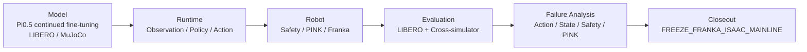
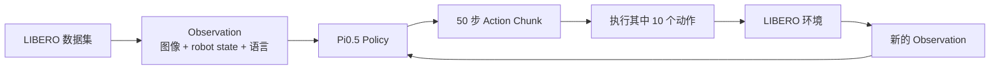
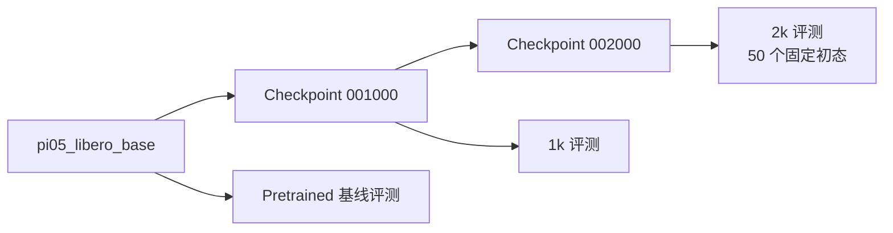
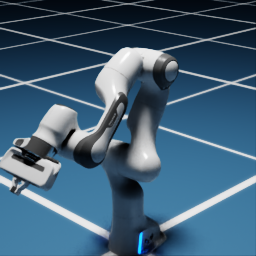
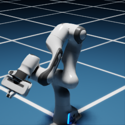

# Pi0.5 VLA：从 LIBERO 持续微调到 Isaac / Franka 闭环与故障分析

## 1. 项目概述

本项目在 Linux GPU 服务器上复现 LeRobot 的 Pi0.5 运行环境，并使用固定版本的 40 任务 LIBERO 数据集，对 `lerobot/pi05_libero_base` 继续微调。项目围绕一个重点 LIBERO-10 任务建立闭环 Rollout 协议，对比 pretrained、1k 和 2k checkpoint，测量模型推理延迟，并根据真实 Rollout 视频分析失败案例。随后将同一 policy 接入 Isaac Sim / ROS 2 / Franka runtime，完成 cross-simulator task evaluation，并用 Action、State、Safety、PINK 与 scripted Oracle 逐层定位失败。

这是一个工程实验与评测项目：LeRobot 提供 policy、数据/训练框架和 LIBERO 集成；本项目负责环境复现、实验控制、性能测量、证据审计和结果整理。

## 三阶段总览：Model → Runtime → Robot → Evaluation → Failure Analysis



| 阶段 | 范围 | 状态 | 最重要结果 |
| --- | --- | --- | --- |
| Phase 1 | LIBERO / MuJoCo policy learning | DONE | 完整 40-task 数据集 continued fine-tuning 2,000 steps；2k checkpoint 在同一重点任务 50 个固定初态上 46/50 |
| Phase 2 | Isaac Sim / ROS 2 / Franka runtime integration | PASS | Observation、Policy、Action、Safety、PINK 和 Franka 形成 5-cycle receding-horizon closed loop |
| Phase 3 | Cross-simulator task evaluation 与 failure analysis | CLOSED OUT | Step 6 为 0/3；定位并修复 state、Safety 与 PINK robot-side blockers；scripted pipeline 当前为 ROBUST PASS；单次 post-fix Pi0.5 diagnostic 为 `NO_CLEAR_IMPROVEMENT` |

三个阶段的指标不可混用：`46/50` 是同一指定 LIBERO 任务的固定初态结果，不是完整 LIBERO benchmark 成功率，也不是 Isaac 成功率；scripted Oracle 不调用 Pi0.5，因此也不是 policy 成功率。

## 2. 系统流程





## 3. 数据集

训练使用完整的 `lerobot/libero` 数据集，revision 固定为 `a1aaacb7f6cd6ee5fb43120f673cebb0cfea7dd4`：

| 属性 | 数值 |
| --- | ---: |
| 任务数 | 40 |
| Episodes | 1,693 |
| Frames | 273,465 |
| Suites | Spatial、Object、Goal、LIBERO-10 |
| Observation | 两路 256×256 RGB 视频 + 8 维状态 |
| Action | 7 维连续控制 |

四个 suite 各含 10 个任务。训练没有使用 task filter，因此这是**多任务持续微调**，不是单任务微调。重点评测指令为 `put both the alphabet soup and the tomato sauce in the basket`，对应 `libero_10` task 0，在训练数据中是 `task_index=5`。

## 4. 训练配置

| 配置项 | 数值 |
| --- | --- |
| 起始 checkpoint | `lerobot/pi05_libero_base` |
| 训练步数 / batch size | 2,000 / 1 |
| 精度 | BF16 policy + BF16 mixed precision |
| 可训练范围 | 仅训练 expert；冻结 vision encoder |
| 显存控制 | 开启 gradient checkpointing |
| GPU | NVIDIA RTX 6000D，PyTorch 报告 83.05 GiB |
| 峰值 allocated / reserved 显存 | 12.848 / 13.004 GiB |
| 平均 / 中位 step 时间 | 0.2237 / 0.2096 秒 |
| Wrapper 总运行时间 | 578.46 秒（9.64 分钟） |
| 结果 | 2,000 步 loss 均为有限值；保存 1k/2k checkpoint；无 OOM |

起始 checkpoint 是 LIBERO 专用的 base checkpoint，而不是通用 `pi05_base`。Pi0.5 由 LeRobot 实现，本项目没有声称发明或重新实现模型架构。

## 5. 评测协议

重点任务是 `libero_10` task 0，episode horizon 为 520 个控制步。每个 episode 使用 hard reset、LIBERO 存储的固定 initial state、两路 360×360 RGB 相机、robot state、相对 7 维动作、BF16 推理、batch size 1 和 `n_action_steps=10`。成功由环境的 `check_success()` 判定。

延迟只测量真实的 `predict_action_chunk` 调用，并在计时前后执行 CUDA synchronization。模型调用之间从 action deque 取出的 9 个缓存动作不计为推理。严格匹配的 checkpoint 对比使用固定状态 0–9；扩展后的 2k 评测覆盖全部 50 个存储状态。

详细协议：[results/evaluation/eval_protocol.md](results/evaluation/eval_protocol.md)。

## 6. 实验结果


| Checkpoint | 评测集合 | 成功数 | 平均 Episode 长度 |
| --- | --- | ---: | ---: |
| Pretrained | 固定状态 0–9 | 0/10 | 520.0 |
| 1k | 固定状态 0–9 | 9/10 | 290.0 |
| 2k | 固定状态 0–29 | 28/30 | 291.13 |

在严格匹配的前十个状态上，2k 为 10/10，平均 episode 长度为 271.9。2k 在全部 50 个固定初态上的结果为 46/50：


状态 30–49 是新增评测、此前未评测的固定初态，不能证明它们在模型训练阶段未出现。


图中展示全部 2,000 个原始 loss，没有人为平滑。1k 到 2k 的 checkpoint 单点 loss 并非单调下降，但匹配 Rollout 成功率有所提高，因此 loss 与闭环成功率必须作为不同指标分别报告。

## 7. 失败分析

2k 在 50 个固定状态中共有 4 次失败：ID 14、18、41 和 49。视频审查发现四次都出现了**错误物体选择（wrong-object-selection）行为**：policy 操作或放置了干扰物，并在 horizon 结束前未能放置两个指定目标物。

- **实际观察：** 选择或放置错误物体；部分 episode 还出现杂物碰撞或恢复不完整。
- **可能解释：** 视觉目标选择、语言条件或 policy 恢复行为可能参与其中。
- **未被证明：** VLM 内部语义或语言理解模块发生故障。

失败证据：[results/evaluation/generalization/failure_analysis.md](results/evaluation/generalization/failure_analysis.md)。

## 8. 项目收获

- 理解图像、语言、robot state 和 action 如何组成 VLA 数据接口；
- 理解 Pi0.5 如何从 Observation 生成 Action Chunk；
- 理解 expert-only、冻结视觉特征、BF16 和 gradient checkpointing 的显存权衡；
- 理解为什么 checkpoint 选择需要闭环评测，不能只看 loss；
- 学会定义可复现的 initial state、horizon、success、latency 和视频协议；
- 理解随机 seed 与 LIBERO 固定 `init_state_id` 并不等价；
- 学会用视频建立行为失败分类，同时避免臆测模型内部原因；
- 理解为什么声称泛化前必须审计训练数据暴露范围。

## 9. 局限性

- 未执行完整的 400-episode、四 suite LIBERO benchmark；
- 未证明 unseen-task transfer 或 open-world generalization；
- 固定状态 30–49 只是此前未被评测，不能证明为 training-held-out states；
- `pi05_libero_base` 本身已经接受过 LIBERO 训练；
- 深度 checkpoint 对比和 50-state 评测主要针对一个 LIBERO-10 任务；
- 未进行 LIBERO-plus 扰动或真实机器人部署；Isaac Step 6 已建立同语义任务并完成 3 次 cross-simulator rollout，但结果为 0/3；
- Isaac state orientation mapping 仍为 `UNRESOLVED`，image-state skew 最大约 0.15 s，目标碰撞体与相机标定仍含近似；
- post-fix Pi0.5 只运行一个不计入 benchmark 的 diagnostic episode，并出现 99/100 cycles action clipping，不能形成新的成功率或模型有效性结论；
- `46/50` 是同任务固定初态结果，不是“LIBERO 成功率 92%”。

## 10. 复现方法

完整环境、训练、checkpoint 评测、固定初态审计和结果生成命令记录在 [notes/commands.md](notes/commands.md)。最短远程流程如下：

```bash
source /root/autodl-tmp/vla_env.sh

# 已验证的 2k 持续微调；现有脚本拒绝覆盖已有结果。
bash /root/autodl-tmp/VLA-Intern-Sprint/scripts/run_pi05_first_stage_2k.sh

# Pretrained 基线与 2k checkpoint 评测。
bash /root/autodl-tmp/VLA-Intern-Sprint/scripts/run_pi05_baseline_eval.sh
bash /root/autodl-tmp/VLA-Intern-Sprint/scripts/run_pi05_checkpoint_eval.sh

# 1k/2k 稳定性和新增固定初态评测。
bash /root/autodl-tmp/VLA-Intern-Sprint/scripts/run_pi05_checkpoint_stability_eval.sh
bash /root/autodl-tmp/VLA-Intern-Sprint/scripts/run_pi05_heldout_init_eval.sh
```

不要在已有结果目录上重新运行这些命令。完整环境版本、路径、离线 cache 设置和拒绝覆盖保护均记录在命令文档中。

## 项目贡献边界

**LeRobot 提供：** dataset/policy/training 基础框架、Pi0.5 implementation 和 LIBERO integration。

**本项目完成：** 可复现环境构建、训练暴露审计、2k continued fine-tuning 执行、checkpoint 管理、LIBERO 基线与闭环协议、延迟 profiling、固定初态评测、Isaac / ROS 2 / Franka VLA runtime、cross-simulator evaluation，以及对 state interface、Safety 浮点边界和 PINK controller architecture 的系统化故障定位与最小修复。

**本项目没有声称：** 重新实现 Pi0.5、完整 LIBERO benchmark SOTA、unseen-task/open-world generalization、sim-to-real、真实机器人部署、RL/LoRA improvement 或 world-model capability。

## Phase 2：Isaac Sim / ROS 2 接口进展

截至 2026-08-12，Phase 2 已完成 Step 1–5：Isaac Sim 6.0.1 中加载 Franka，建立两路 256×256 RGB、机器人状态和 Policy Input Adapter；真实 2k Pi0.5 checkpoint 可产生有限的 `[1,50,7]` Action Chunk，Action Adapter 再将首动作转换为经过裁剪和安全检查的 PINK 目标。

Step 4 从实际 robosuite 1.4.0 源码确认 `OSC_POSE` 的缩放和 world/spatial 左乘旋转语义，并使用 Isaac 6.0.1 官方 PINK differential IK 完成三轴平移、三轴旋转及夹爪合成测试。全部安全门通过后，只运行一次 Pi0.5 inference 并只执行 `action_chunk[0]`：Franka 产生可测运动，目标位置/姿态误差为 1.115 mm / 7.030 mrad，剩余49步未执行，没有自动第二次 inference、闭环、抓取或任务评测。




视频见 [单动作执行 MP4](assets/videos/phase2_step4_action_execution.mp4)。这仍只是 **单次 open-loop action execution smoke test**，不是 Isaac 任务 Rollout 或真实机械臂部署。详细证据见 [Step 4 总结](results/phase2_step4/summary.md)。

Step 5 在同一 Isaac 场景中完成 5 轮最保守 receding-horizon 闭环：每轮重新采集两路图像和 8D robot state，真实调用一次 `predict_action_chunk`，仅执行 `action_chunk[0]`，然后用运动后的新 Observation 再推理。五轮图像、状态与首动作均不同；总 EEF 直线位移 25.384 mm；推理 mean/median/p95 为 233.742/187.041/374.803 ms，去除 Cycle 0 warm-up 后 mean 为 186.743 ms；Torch peak allocated/reserved 为 8.868/9.199 GiB，无 OOM。




视频见 [Step 5 五轮闭环 MP4](assets/videos/phase2_step5_closed_loop.mp4)，完整证据见 [Step 5 总结](results/phase2_step5/summary.md)。该结果只证明 **closed-loop runtime PASS**；当前 Isaac 空场景没有目标物体和任务成功判据，因此没有评测抓取、task success、LIBERO transfer 或跨域泛化。

## Phase 3 / Step 6：LIBERO → Isaac 同语义任务验证

Step 6 从实际安装的 LIBERO 源码、BDDL、固定 initial states、相机和 success predicate 出发，在 Isaac Sim 中重建任务：`put both the alphabet soup and the tomato sauce in the basket`。两个目标罐、篮子和桌子复用真实 LIBERO mesh/texture；已知的碰撞、背景、相机、控制和 physics 近似均单独标记，没有修改 LeRobot/LIBERO 上游源码，也没有训练或更新 2k checkpoint。


| Episode | 固定 initial state | 结果 | Cycles | 终止 |
| --- | ---: | --- | ---: | --- |
| 00 | 0 | FAIL | 100 | HORIZON_REACHED |
| 01 | 1 | FAIL | 100 | HORIZON_REACHED |
| 02 | 2 | FAIL | 100 | HORIZON_REACHED |

Experimental Pipeline 为 **PASS**：场景、成功判定、hard reset、两路 observation、300 次真实 Pi0.5 inference、Action Adapter、Safety、PINK、K=1 closed loop 和 artifacts 均完成；Policy Task Result 为 **0/3**，Task Transfer 为 **FAIL**。三次都没有 OOM 或人工干预。机械臂在任务区和篮子附近运动，但两个目标罐测得位移均为 0，因此行为分类为 failed approach、failed grasp、horizon reached。可能的视觉、相机、状态、action 和 physics domain gap 只是解释假设，不是已证明的 Pi0.5 内部根因。

300 次推理 mean/median/p95 为 182.876/181.603/184.141 ms，steady-state mean 为 181.916 ms；全局 `nvidia-smi` peak 为 13,059 MiB，OOM=NO。完整报告见 [Step 6 总结](results/phase3_step6/summary.md)，三段真实视频见 [episode 0](assets/videos/phase3_step6_ep00.mp4)、[episode 1](assets/videos/phase3_step6_ep01.mp4) 和 [episode 2](assets/videos/phase3_step6_ep02.mp4)。

这是 **cross-simulator/cross-environment evaluation**，不是 unseen-task、zero-shot new-task、open-world generalization 或 sim-to-real。

## Phase 3 收尾：Robot-side Oracle 与主线冻结

Step 6 之后的 Action Parity Audit 没有确认 sign、scaling 或 Action Adapter bug。State Mapping 修复将 calibration position error 的 mean/max 从 37.870/70.814 mm 降至 7.874/8.207 mm，将 hold-out 从 62.852/79.705 mm 降至 7.800/7.898 mm；gripper state 改为 `[finger1, -finger2]`。Orientation 仍为 `UNRESOLVED`，约 0.15 s image-state skew 继续作为已知限制。

不使用 Pi0.5、视觉和语言决策的 scripted Oracle 首先得到 Alphabet soup 3/3、Tomato sauce 0/3。Tomato 失败被依次定位为 Safety 浮点边界 false positive，以及 PINK arm IK 错误包含 finger joints。采用浮点安全比较并将 PINK 从 9D arm+finger 改为 7D arm-only、保持 gripper 独立后，Tomato 正式 post-fix validation 为 3/3。结合既有 Alphabet 3/3，当前 scripted robot-side manipulation pipeline 为 **ROBUST PASS**；该结果不是 Pi0.5 成功率。

Robot-side blockers 清除后只运行一次 `DIAGNOSTIC / NOT COUNTED` 的 Pi0.5 episode：100 cycles、K=1、无 Safety violation、无 IK failure，但仍未成功、未产生目标物运动或可信抓取，且 99/100 cycles 发生 action clipping。行为变化记为 `NO_CLEAR_IMPROVEMENT`，但单次诊断不能证明 Pi0.5 本身无效。

最终工程决策为 **`FREEZE_FRANKA_ISAAC_MAINLINE`**。完整证据边界、故障分析时间线和结构化指标见 [Phase 3 Final Closeout](notes/phase3_final_closeout.md) 与 [最终摘要](results/phase3_final_summary/summary.md)。下一主阶段只记录为 `SO-101_REAL_ROBOT / PLANNED_NOT_STARTED`，当前没有启动。
