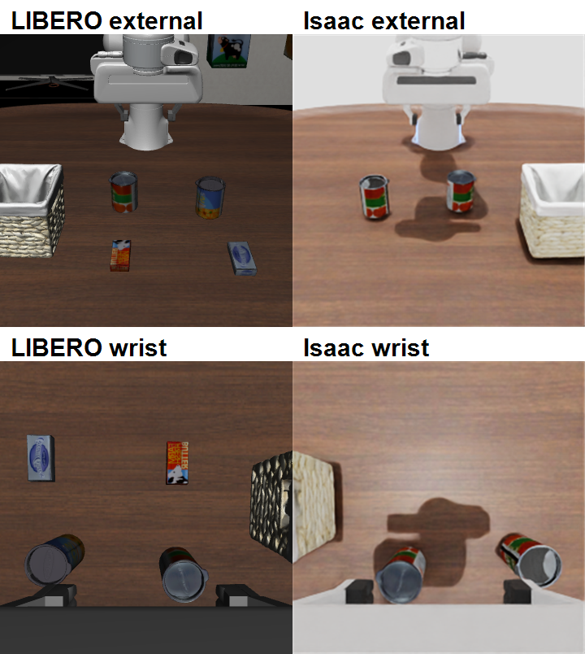

# Phase 3 / Step 6：视觉域差异

此图仅做等尺寸排版和文字标记，没有美化、颜色校正、裁掉失败内容或生成像素。

## 已确认差异

- 物体外观：两个目标罐和篮子使用同一 LIBERO mesh/texture，身份和尺度保留；Isaac 材质、反射和阴影仍不同。
- 相机：external 的 source world pose 和 vertical FOV 已映射，但渲染投影实现不同；wrist 仅在初态对齐后刚性跟随 Isaac `panda_hand`。
- 灯光：LIBERO 和 Isaac 的光源、曝光、阴影强度明显不同。
- 背景：Isaac 未复制完整 living-room 墙面和装饰。
- 干扰物：LIBERO 画面中还有 cream cheese、ketchup 等物体，Isaac Step 6 只保留两个目标物和篮子。
- Robot：虽然都是 Panda 系列，模型材质、夹爪外观和相机遮挡不同。
- 纹理：桌子主纹理保留，但源 OBJ 引用的 `louisa-coffee-table-wood-bump.jpg` 在 LIBERO 资产目录中不存在，USD 转换日志如实保留该警告。

这些差异构成可能的视觉分布偏移，但仅凭 0/3 结果不能证明 Pi0.5 内部视觉模块发生了特定故障。
